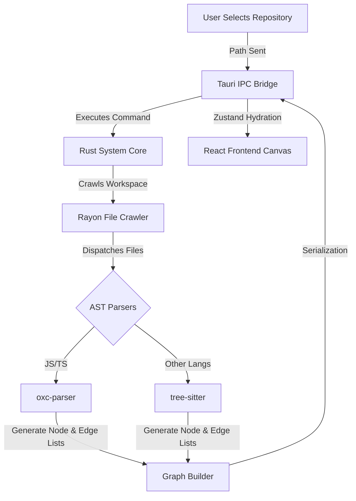
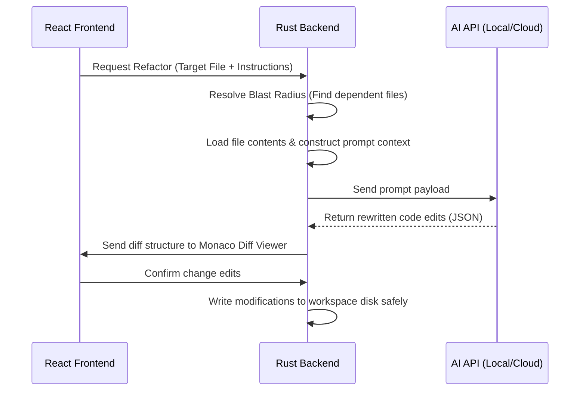

# Dataflow Visualiser

  
<strong>Understand massive codebases before touching a single line of code.</strong>

  
A native, local-first developer platform for indexing, visualizing, and simulating dependency architectures in stunning 2D and 3D.

  
  
  
  

 

  <!-- Hero Showcase Visual Placeholder -->
  

---

## The Problem

Large codebases grow increasingly opaque over time. For engineers stepping into a legacy environment, or taking on a massive refactor, a single question looms: **"If I touch this file, what downstream components break?"**

Standard solutions fail to solve this problem effectively:
*   **Static dependency visualisers** generate chaotic, unreadable spaghetti graphs that lack interactive filtering or structure.
*   **Cloud-based visualization platforms** require uploading proprietary code to external servers, violating data security compliance rules.
*   **Text-only editor references** lack visual structure, failing to trace cascading, multi-hop import chains.
*   **Refactor fear** causes developers to duplicate code, leaving dead exports and circular dependencies in place to avoid breaking the application.

---

## The Solution

Dataflow Visualiser turns your local directory into an **interactive spatial map**. By parsing your codebase locally via a native compiler-grade scanner, it provides real-time visualizations and predictive simulations without uploading code to the cloud:

*   **Sub-millisecond AST Parsing**: Utilizes Rust and `oxc-parser` to parse and build dependency nodes at hardware speed.
*   **Predictive Blast-Radius Traversals**: Simulates modifications and highlights direct and indirect downstream impacts.
*   **Context-Aware local AI Reasoning**: Maps domain layers and performs executable refactoring safely within your workspace sandbox.
*   **Interactive 2D & 3D Topologies**: Renders multi-tiered directory boundaries, dependencies, and complex relations.

---

## Feature Showcase

### 1. Blast Radius Simulation
Select any module to simulate structural edits. The traversal engine highlights downstream import lines, warning you of cascading breaking risks before you write code:
*   **Engineering Value**: Helps developers plan refactoring paths and avoid regression cycles.
*   **UI Reference**: Displays files color-coded from Crimson Red (direct imports) to Amber (transitive references).
*   **Implementation**: Traversal logic is written in [blastRadius.ts](file:///c:/Users/dasan/Documents/Dataflow-Visualiser/frontend/utils/blastRadius.ts); user actions are captured in [RefactorPreview.tsx](file:///c:/Users/dasan/Documents/Dataflow-Visualiser/frontend/features/refactor/RefactorPreview.tsx).

  

---

### 2. Dependency Graph Explorer
Examine codebase topologies in 2D or 3D, grouping files by directory folders. Switch views seamlessly:
*   **Engineering Value**: Speeds up codebase onboarding and visualizes folder coupling.
*   **UI Reference**: Multi-axis rotation, panning, dynamic node scaling, and edge directionality.
*   **Implementation**: Built using [@xyflow/react](file:///c:/Users/dasan/Documents/Dataflow-Visualiser/package.json) for 2D flow structures and Three.js / WebGL for 3D force-directed arrays. See [ReactFlowGraph.tsx](file:///c:/Users/dasan/Documents/Dataflow-Visualiser/frontend/components/graph/ReactFlowGraph.tsx) and [ThreeDGraph.tsx](file:///c:/Users/dasan/Documents/Dataflow-Visualiser/frontend/components/graph/ThreeDGraph.tsx).

---

### 3. AI Refactor Analysis
Leverages artificial intelligence to automate refactoring based on blast-radius maps:
*   **Engineering Value**: Automates updates across dependent files.
*   **UI Reference**: Side-by-side Monaco diff panel displaying code modifications prior to writing to disk.
*   **Implementation**: Dispatched in [RefactorPreview.tsx](file:///c:/Users/dasan/Documents/Dataflow-Visualiser/frontend/features/refactor/RefactorPreview.tsx), utilizing prompt generation in [ai.rs](file:///c:/Users/dasan/Documents/Dataflow-Visualiser/src-tauri/src/ai.rs).

---

### 4. Repository Heatmaps & Git Churn
Highlights refactoring targets by painting codebases with volatility indexes:
*   **Engineering Value**: Identifies high-risk nodes (e.g. high code churn combined with complex structure).
*   **UI Reference**: Overlay options that map complexity values or Git change frequencies to node colors.
*   **Implementation**: Integrates native Git mappings using the `git2` crate in [git.rs](file:///c:/Users/dasan/Documents/Dataflow-Visualiser/src-tauri/src/git.rs).

---

### 5. Local-First Indexing
Indexes codebases locally and updates layout states incrementally:
*   **Engineering Value**: Ensures high performance without sending code to cloud services.
*   **UI Reference**: Progression logger showing active directories parsed.
*   **Implementation**: Scanned using native file walkers and language parsers in [parser/mod.rs](file:///c:/Users/dasan/Documents/Dataflow-Visualiser/src-tauri/src/parser/mod.rs).

---

### 6. Relationship Visualization & Coupling Matrix
Visualizes reciprocal linkages in a detailed Adjacency Matrix checkerboard:
*   **Engineering Value**: Highlights cyclic dependency issues and tight architectural coupling.
*   **UI Reference**: Grid intersections showing coupling warnings.
*   **Implementation**: Rendered in [MatrixPanel.tsx](file:///c:/Users/dasan/Documents/Dataflow-Visualiser/frontend/features/matrix/MatrixPanel.tsx).

---

## System Architecture

Dataflow Visualiser separates interface rendering from systems computation using a secure, low-latency IPC architecture.

### High-Level Block Flow

### AI Refactor Flow

For more details, see the [Architecture Document](file:///c:/Users/dasan/Documents/Dataflow-Visualiser/docs/architecture.md).

---

## How It Works Internally

### Native AST Extraction
Dataflow Visualiser avoids slow regular expression string scans. Instead, it parses source files into Abstract Syntax Trees:
*   **JavaScript/TypeScript**: Utilizing the [oxc-parser](file:///c:/Users/dasan/Documents/Dataflow-Visualiser/src-tauri/src/parser/languages/javascript.rs) package to extract AST signatures in Rust, mapping import paths and structural exports.
*   **Other Languages**: Leverages tree-sitter grammars to map dependencies across Rust, Python, Go, Java, C#, and Dart structures.

### Module Resolution & Flat Alias Maps
Resolves paths like `@/components/Button` by reading `tsconfig.json` configurations (see [alias.rs](file:///c:/Users/dasan/Documents/Dataflow-Visualiser/src-tauri/src/parser/utils/alias.rs)). The engine flattens barrel files to map dependencies directly, preventing canvas clutter.

### Downstream DFS Traversals
Blast radius metrics are computed via a Depth-First Search (DFS) on the reversed dependency graph, calculating hop distances to classify node risks.

---

## Performance Benchmarks

The following benchmarks show performance metrics recorded across varying codebase sizes:

| Repository | Files Count | Lines of Code | Indexing Time | Peak Memory | Cache Reads |
| :--- | :--- | :--- | :--- | :--- | :--- |
| **react-hooks-library** | ~120 | ~15,000 | **0.08 seconds** | 42 MB | Yes |
| **vite-app-boilerplate** | ~450 | ~62,000 | **0.31 seconds** | 78 MB | Yes |
| **vscode-sandbox-mode**| ~12,400 | ~1,850,000 | **4.22 seconds** | 310 MB | Yes |

*Benchmarks evaluated on an Apple M3 Max (16-core configuration, 32GB RAM).*

---

## Privacy & Security

*   **Local-First Parsing**: Source files are parsed locally on your machine.
*   **Opt-In AI Prompts**: Only code selected for Q&A or refactoring is sent to the configured AI API.
*   **Local LLM Integration**: Supports Ollama and LMStudio OpenAI-compatible endpoints to keep data offline.
*   **Path Validation**: All backend file write commands validate paths against the active workspace boundary.

---

## Roadmap

*   **Phase 1**: Semantic Search integration, Multi-repository support, Live Git visualizers.
*   **Phase 2**: Collaborative review sessions, automated markdown documentation generation.
*   **Phase 3**: CI/CD check integrations, LSP diagnostics, real-time file updates.

See [Roadmap](file:///c:/Users/dasan/Documents/Dataflow-Visualiser/docs/roadmap.md) for future feature details.

---

## Contributing

We welcome developer contributions! To get started:
1.  Read our [Contributing Guide](file:///c:/Users/dasan/Documents/Dataflow-Visualiser/docs/contributing.md) for build requirements.
2.  Set up your local environment (Node.js + Rust).
3.  Open a Pull Request with your feature changes.

---

## License

Distributed under the MIT License. See [LICENSE](LICENSE) for details.
