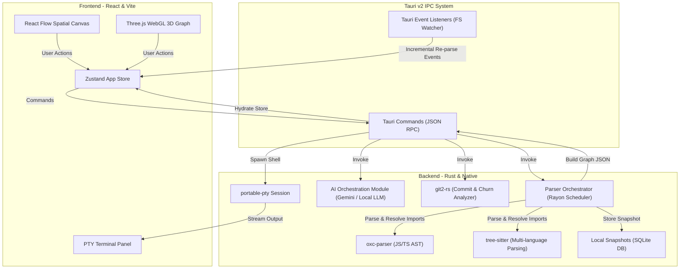

# System Architecture

Dataflow Visualiser is a native, local-first developer platform designed to parse, index, and visualize codebase architectures in real-time. It separates system-level file and AST operations from visual rendering via a highly optimized desktop sandbox.

---

## 1. Native Desktop Boundary (Tauri v2)

The application uses **Tauri v2** to establish a secure, low-latency bridge between a web-based rendering environment and the local filesystem:

*   **IPC Bridge**: Communication between React and Rust is handled via serialized JSON-RPC channels over Tauri's command system.
*   **Security Sandboxing**: The frontend runs in a sandboxed WebView wrapper. Backend operations validate that all file operations are strictly bounded inside the selected user workspace root to prevent unauthorized directory traversal.
*   **Settings Persistence**: Configurations (e.g. model endpoints, theme overrides, keyboard shortcuts) are stored locally in JSON format via the native Rust-based [tauri-plugin-store](file:///c:/Users/dasan/Documents/Dataflow-Visualiser/src-tauri/Cargo.toml).

---

## 2. Core Backend Engine (Rust)

The backend is engineered for high-performance codebase analysis and handles all CPU-bound operations:

*   **AST Parsers**:
    *   **JS/TS Parsing**: Leverages the high-speed Rust parser [oxc-parser](file:///c:/Users/dasan/Documents/Dataflow-Visualiser/src-tauri/src/parser/languages/javascript.rs) for sub-millisecond parsing of JavaScript and TypeScript files.
    *   **Polylingual Fallback**: Employs [tree-sitter](file:///c:/Users/dasan/Documents/Dataflow-Visualiser/src-tauri/src/parser/languages/mod.rs) to read and extract dependencies for Go, Rust, Python, Java, C#, Dart, and CMake/ESP-IDF modules.
*   **Multithreaded Walking**: Uses [Rayon](https://github.com/rayon-rs/rayon) to parallelize directory scanning and file parsing, saturating all CPU cores during the initial indexing stage.
*   **Snapshot Journaling**: Integrates a local SQLite engine to snapshot dependency states. This enables developers to diff layout versions and measure architectural drift over time.
*   **Git Integration**: Uses the `git2` crate to pull commit logs, parse diffs, and calculate code churn heatmaps directly on top of the dependency topology.

---

## 3. Spatial Rendering Interface (React & WebGL)

The frontend is a dedicated IDE interface optimized for presenting high-density relationship graphs:

*   **Zustand State Engine**: A centralized state manager utilizing shallow comparisons (`useShallow`) to ensure that canvas dragging, filtering, and inspect actions do not trigger unnecessary React re-renders.
*   **2D Node Canvas**: Powered by [@xyflow/react](file:///c:/Users/dasan/Documents/Dataflow-Visualiser/package.json), rendering node elements with custom React components and optimizing connector line redraws.
*   **3D Force Canvas**: An alternative WebGL canvas using Three.js/Fiber to display massive repositories where 2D layouts would lead to node collision or layout lag.
*   **Layout Computation**: Leverages Web Workers to compute [Dagre](file:///c:/Users/dasan/Documents/Dataflow-Visualiser/frontend/utils/layout.ts) hierarchical placements off the main thread, keeping the user interface interactive.
*   **Interactive Sandpack**: Renders isolated component code in a live local preview, resolving imports and aliases in real-time.

---

## 4. Lifecycle Data Flows

### Indexing Flow

1.  **Selection**: The user selects a project directory via the Tauri dialog wrapper [useProjectLoader.ts](file:///c:/Users/dasan/Documents/Dataflow-Visualiser/frontend/hooks/useProjectLoader.ts).
2.  **Dispatch**: The frontend sends the path string to the Rust backend command `parse_project`.
3.  **Traversal**: The Rust parser-orchestrator ignores paths flagged in `.gitignore` or standard blocklists (`node_modules`, `.git`, `dist`, etc.) using a custom file walker.
4.  **Extraction**: Files are mapped into a thread pool; AST parsing extracts import statements, exports, and relative resolution patterns.
5.  **Resolution**: TSConfig paths/aliases are resolved to build a clean relational Graph (Node list and Edge list).
6.  **Response**: The backend serializes the complete graph JSON and responds to the IPC command.
7.  **Render**: The Zustand store merges the nodes, triggers layout computation inside the Web Worker, and feeds the resulting coordinates to the React Flow viewport.
