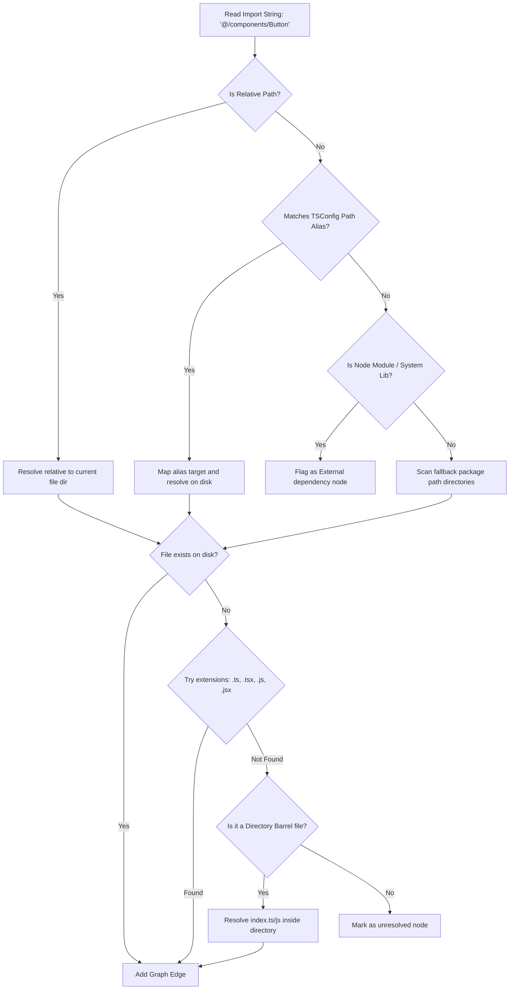

# Indexing & Parsing Engine

The core value of Dataflow Visualiser lies in its high-speed codebase scanner. The engine constructs a precise dependency graph by scanning local files, extracting AST structures, and resolving references natively.

---

## 1. High-Performance AST Ingestion

Unlike tooling built on Node.js that runs slow AST scans, Dataflow Visualiser leverages a native Rust pipeline:

### JavaScript & TypeScript (oxc-parser)
*   **Speed**: Scans and parses JS/TS/JSX/TSX codebases at over **10,000 files per second** per core.
*   **Implementation**: Utilizes `oxc-parser` to parse files into an Abstract Syntax Tree (AST). It walks import declarations, export declarations, and dynamic `import()` or CommonJS `require()` calls.
*   **Export Analysis**: Tracks named and default exports to detect unused code paths and identify dead code blocks.

### Multi-Language parsing (Tree-Sitter)
For non-JavaScript environments, the engine falls back to [tree-sitter](file:///c:/Users/dasan/Documents/Dataflow-Visualiser/src-tauri/src/parser/languages/mod.rs) grammars:
*   **Rust**: Parses `Cargo.toml` dependencies and traverses module hierarchies (`mod.rs` and inline `mod` declarations).
*   **Python**: Resolves import paths, supporting absolute imports (e.g. `from module.sub import obj`) and tracking Django/Flask configurations.
*   **Go**: Scans packages, imports, and resolves standard packages from external `go.mod` files.
*   **C# & Java**: Traverses namespace scopes, class imports, and detects Dependency Injection bindings (e.g. Spring `@Autowired` or .NET `AddScoped` bindings).
*   **Dart & Flutter**: Extracts widget trees and resolves pub package declarations.
*   **CMake & ESP-IDF**: Tracks subdirectory linkages and compilation bindings.

---

## 2. Dependency Resolution Algorithm

Simply reading string literals from import statements is insufficient. The engine implements a robust resolver to determine the exact destination file:

### Path Alias Resolution
The resolver parses `tsconfig.json` (or `jsconfig.json`) mappings. In [alias.rs](file:///c:/Users/dasan/Documents/Dataflow-Visualiser/src-tauri/src/parser/utils/alias.rs), it dynamically maps prefixes like `@/*` to their configured paths, allowing deep resolutions to link properly.

### Barrel File Flattening
Barrel files (e.g. `index.ts` files that merely re-export interfaces from multiple adjacent directories) can clutter dependency graphs with noisy hub-and-spoke nodes. The engine actively flattens these routes:
*   If a file only contains export statements targeting other subfiles, the resolver bypasses the barrel file node.
*   Edges are drawn directly from the importer to the actual implementing module, keeping the canvas neat.

---

## 3. Directory Traversal & Ignore Rules

To maintain high throughput, the crawler behaves like a compilation compiler:
*   **`.gitignore` Compliance**: Respects ignore rules specified in local `.gitignore` files.
*   **Default Exclusions**: Ignores massive build directories, lockfiles, and environment assets (e.g., `node_modules`, `dist`, `.git`, `.next`, `target`, `build`, `venv`).
*   **Recursive Walkers**: Built with native Rust thread pools using [Rayon](https://crates.io/crates/rayon), files are processed out of order in memory and accumulated in a thread-safe graph builder wrapper.
